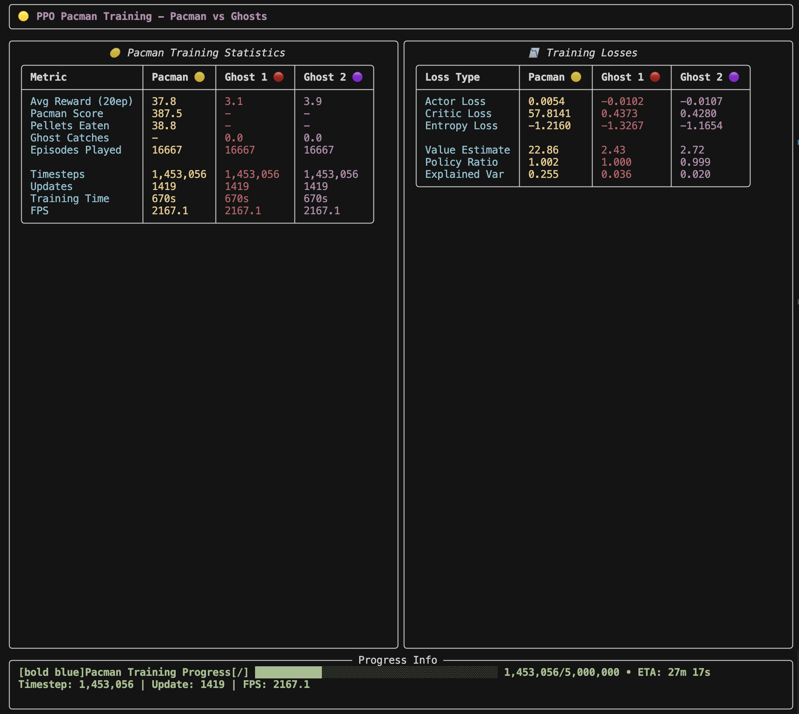

# 🟡 Pacman Reinforcement Learning Environment

A multi-agent reinforcement learning environment where Pacman competes against Ghosts using PPO (Proximal Policy Optimization).



## 🎮 Game Description

- **1 Pacman** vs **2 Ghosts** in a maze environment
- **Pacman** wins by collecting all pellets
- **Ghosts** win by catching Pacman
- Grid-based movement with walls and obstacles
- Full visibility between all agents

## 📁 Project Structure

```
├── env.py              # Core Pacman environment (Gymnasium interface)
├── train.py            # Full PPO training with rich console display
├── demo.py             # Watch trained agents play
├── quick_train.py      # Optimized quick training script
├── test.py             # Environment testing suite
├── requirements.txt    # Python dependencies
└── README.md          # This file
```

## 🚀 Quick Start

### 1. Install Dependencies
```bash
pip install -r requirements.txt
```

### 2. Test Environment
```bash
python test.py
```

### 3. Quick Training (faster learning rate, higher batch size)
```bash
python quick_train.py --timesteps 100000
```

### 4. Watch Trained Agents
```bash
python demo.py --model quick_trained_models.pth --episodes 5
```

## 🎯 Training Options

### Quick Training (Recommended for first try)
```bash
# Fast training with optimized parameters
python quick_train.py --timesteps 150000

# With visualization (slower but educational)
python quick_train.py --show --timesteps 100000
```

### Full Training (production quality)
```bash
# Complete training with all metrics
python train.py --timesteps 300000

# With live visualization
python train.py --show --timesteps 200000

# Custom maze size
python train.py --maze-width 15 --maze-height 17 --timesteps 250000
```

## 🎮 Demo Options

```bash
# Basic demo
python demo.py

# Multiple episodes with custom speed
python demo.py --episodes 10 --speed 0.05

# Use specific model
python demo.py --model models_timestep_100000.pth --episodes 3
```

## 📈 Expected Learning Timeline

- **2M steps**: Start to see improvements

## 🔧 Customization

Edit `env.py` to modify:
- Maze generation algorithm
- Reward system
- Agent observation space
- Game mechanics

Edit `train.py` to adjust:
- PPO hyperparameters
- Training schedule
- Network architecture
- Display options